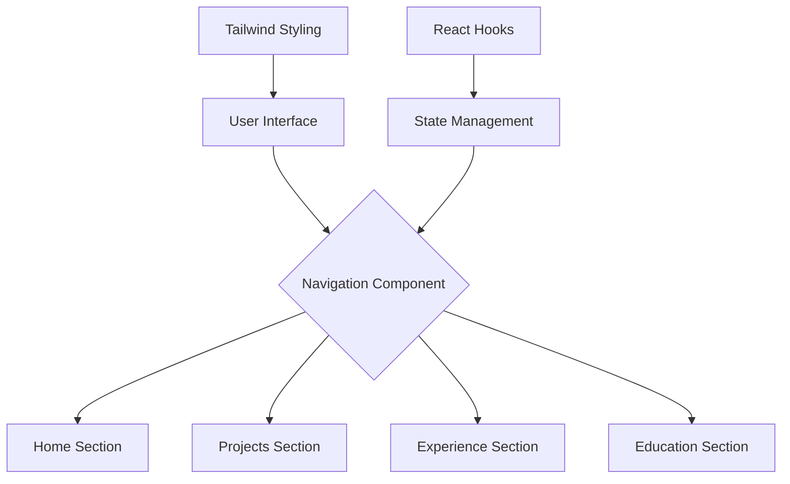

# 🌿 My React App

> EmeraldFlow is a modern, responsive personal portfolio website built with React and Tailwind CSS, designed to showcase professional achievements, projects, and personal branding with an elegant, minimalist aesthetic.

|  |  |
|---------------------------------|---------------------------------------------|

[](https://choosealicense.com/licenses/mit/)
[](https://badge.fury.io/js/melodify)
[](https://github.com/bniladridas/my-react-app/graphs/commit-activity)
[](https://my-react-developer-app.vercel.app/)

## 🏗️ Project Architecture

### System Design Diagram


### Component Structure
- `PersonalPortfolio`: Main container component
  - Home Section
  - Projects Section
  - Experience Section
  - Education Section
- Navigation Buttons
- Dynamic Content Rendering

## 🚀 Features

### Interactive Sections
- Smooth section transitions
- Responsive design
- Aesthetic gradient backgrounds
- Detailed professional information display

### Technical Highlights
- React Hooks for state management
- Tailwind CSS for styling
- SVG-based icons
- Responsive mobile-first approach

## 🔧 Tech Stack
- React
- Tailwind CSS
- JavaScript ES6+
- SVG Graphics

## 📦 Project Setup

### Prerequisites
- Node.js (v14+)
- npm or Yarn
- Visual Studio Code (Recommended)

### Installation Steps
1. Clone the repository
```bash
git clone https://github.com/bniladridas/my-react-app.git
cd my-react-app
```

2. Install Dependencies
```bash
npm install
```

3. Run Development Server
```bash
npm start
```

4. Build for Production
```bash
npm run build
```

## 🎨 Design Philosophy
EmeraldFlow embraces a minimalist design language:
- Dark mode color palette
- Emerald green accent colors
- Subtle animations
- Typography-focused layout
- Emphasis on readability and elegance

## 🌈 Color Palette
- Primary: Emerald Green
- Background: Dark Gray to Black Gradient
- Accent: Soft White and Teal Highlights

## 🤝 Contribution Guidelines
1. Fork the repository
2. Create a feature branch
3. Commit your changes
4. Push to the branch
5. Create a Pull Request

## 📝 Customization
To personalize:
- Replace content in `sections` object
- Modify color schemes in Tailwind config
- Add your personal projects and experiences

## 🔒 License
[MIT LICENSE](LICENSE)

## 📞 Contact
Your Name
- Email: [Press](mailto:ndas1262000@gmail.com)
- LinkedIn: [Visit](https://linkedin.com/in/bniladridas)
- Portfolio: [Live Site](https://my-react-developer-app.vercel.app/)

---

**Made with ❤️ and ☕ by Niladri Das**